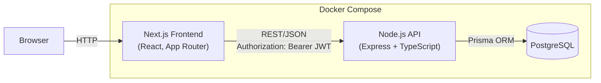
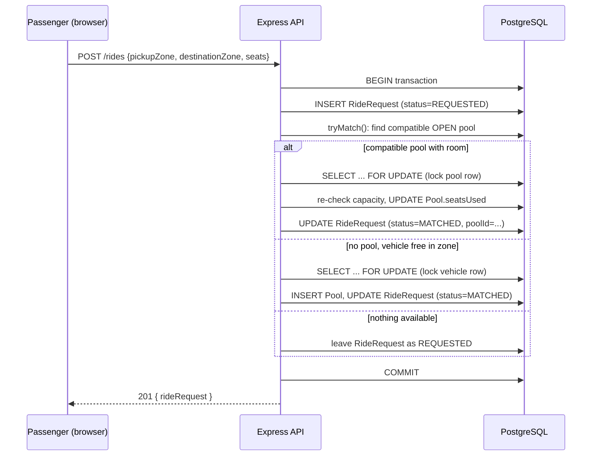

# Architecture

## System Overview

Both containers are built from their own Dockerfiles and orchestrated with `docker compose up`. The database runs with a healthcheck; the backend waits for it before applying migrations and seeding.

## Request flow: creating and matching a ride

## Key decisions

- **REST over GraphQL** — a small, well-defined set of resources (users, rides, pools, vehicles) with simple relationships; REST's simplicity outweighs GraphQL's flexibility for an MVP on a tight timeline.
- **JWT auth** — stateless, no session store, verified per-request via middleware. Role (`PASSENGER` / `DRIVER`) is embedded in the token payload.
- **Prisma ORM over TypeORM** — schema-first workflow, safer auto-generated migrations, full type safety end-to-end.
- **Single Express app, no microservices** — the brief explicitly discourages introducing microservices/Kafka/queues without justification; this system's scale doesn't warrant it.
- **Money stored as integer poysha** (1 Taka = 100 poysha) to avoid floating-point rounding errors in fare math.
- **Ride lifecycle** extends the brief's suggested `MATCHED/ACCEPTED` shorthand into two explicit states, plus an `AWAITING_PAYMENT` step before `COMPLETED`:
  `REQUESTED → MATCHED → ACCEPTED → DRIVER_ARRIVED → STARTED → AWAITING_PAYMENT → COMPLETED (+ CANCELLED)`
  This lets a driver genuinely accept or decline a proposed pool (rather than treating "matched" as automatic acceptance), and ensures a trip can't be marked complete until every pooled rider has paid.
- **Zone-based matching with row-level locking** — a new pool only forms on a vehicle whose `currentZone` matches the pickup zone; joining an existing pool locks that pool's row (`SELECT ... FOR UPDATE`) before the authoritative capacity check, so two simultaneous requests can't overbook the last seat. A vehicle's row is locked the same way before opening a new pool, so two requests can't both claim the same idle car.
- **Decline memory + re-dispatch** — if a driver declines a proposed pool, that vehicle is excluded from ever being offered those same riders again (`PoolDecline`), and the riders are immediately re-run through matching (`dispatchWaitingRequests`) so another eligible driver can pick them up. Dispatch also re-runs when a driver comes online, when a ride is cancelled (freeing a seat), and when a trip completes (freeing the vehicle).
- **Vehicle location updates on drop-off** — a vehicle's `currentZone` is updated to the trip's destination when a pool completes, so matching reflects where the car actually is rather than where the driver started their shift.

## Assumptions

- Vehicles can be provisioned two ways: via seed/admin data (the story cast), or self-registered by a driver on first login if no vehicle exists yet.
- A vehicle can only be assigned to **one active pool (trip) at a time**.
- All ride requests within a pool transition through the lifecycle together, since they're physically in the same car.
- Payment is simulated: a passenger marks their own ride as paid once the trip reaches `AWAITING_PAYMENT`; the driver cannot mark a trip `COMPLETED` until every active rider in the pool has paid.
