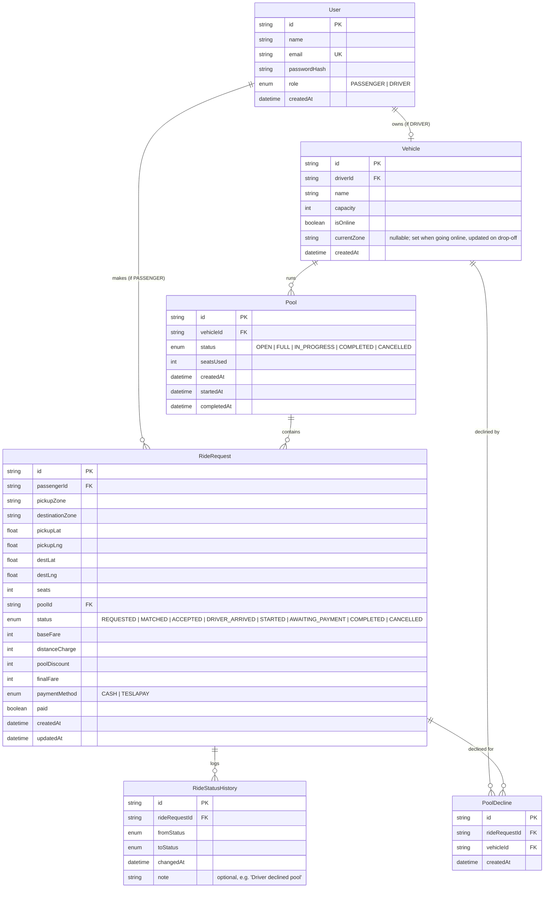

# Entity Relationship Diagram

## Notes

- `Pool.seatsUsed` is a denormalized counter, updated inside a database transaction with a row lock (`SELECT ... FOR UPDATE`) to prevent overbooking under concurrent requests. This is what the concurrency test (`tests/concurrency.test.ts`) verifies directly.
- `RideStatusHistory` is append-only — every status transition creates a new row rather than mutating existing ones, giving a full audit trail per ride, including driver declines.
- `PoolDecline` records which vehicle declined which ride request, so `dispatchWaitingRequests` never re-offers a rider to a driver who already turned them down. `@@unique([rideRequestId, vehicleId])` prevents duplicate decline records.
- A `Vehicle` has at most one `driverId` (1:1) — each driver owns exactly one Tesla in this MVP.
- Money fields (`baseFare`, `distanceCharge`, `poolDiscount`, `finalFare`) are integers in poysha (1 Taka = 100 poysha), avoiding floating-point rounding errors.
